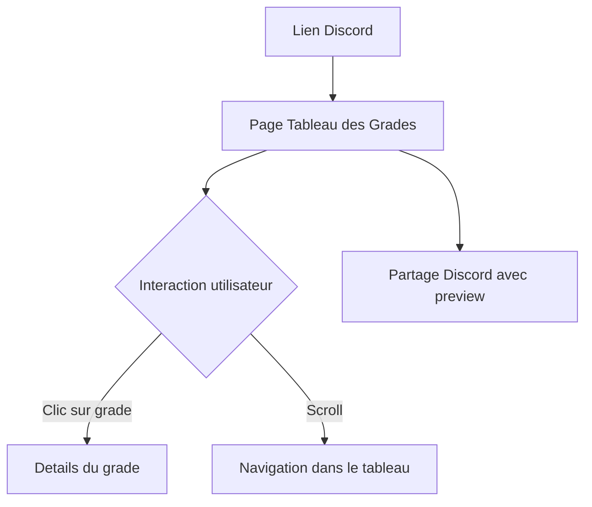

## 1. Vue d'ensemble du produit
Tableau interactif des grades de guilde avec design personnalisé et structure modulaire pour faciliter les mises à jour. Le projet permet d'afficher de manière claire et visuelle la hiérarchie des grades avec leurs permissions associées.

Objectif : Centraliser l'information sur les grades de guilde pour les membres avec une interface moderne et responsive qui respecte l'identité visuelle existante.

## 2. Fonctionnalités principales

### 2.1 Rôles utilisateurs
| Rôle | Méthode d'accès | Permissions |
|------|-----------------|-------------|
| Visiteur | Accès direct | Consulter le tableau des grades |
| Membre de guilde | Lien Discord | Même permissions que visiteur |

### 2.2 Module de fonctionnalités
Le tableau des grades se compose des pages suivantes :
1. **Page principale** : Affichage du tableau interactif avec tous les grades, leurs descriptions et permissions.

### 2.3 Détails des pages
| Page | Module | Description fonctionnelle |
|------|--------|---------------------------|
| Page principale | Tableau des grades | Afficher la hiérarchie complète des grades avec nom, icône, description et permissions associées. Présenter les grades du plus haut au plus bas niveau avec une mise en page claire et visuelle. |
| Page principale | Section détails grade | Au clic sur un grade, afficher une vue détaillée avec toutes les permissions spécifiques et explications détaillées des responsabilités. |
| Page principale | Navigation responsive | Adapter l'affichage pour une lecture optimale sur desktop, tablette et mobile avec des cards empilées sur petits écrans. |
| Page principale | Chargement données Google Sheets | Récupérer automatiquement les données depuis une Google Sheet publiée en format CSV, avec fallback sur fichier JSON local si indisponible. |

## 3. Processus principal
**Flux utilisateur standard :**
L'utilisateur accède à la page via un lien Discord → Le tableau des grades s'affiche avec la hiérarchie complète → L'utilisateur peut cliquer sur un grade pour voir les détails → La page est optimisée pour le partage sur Discord avec preview embed.

## 4. Interface utilisateur

### 4.1 Style de design
- **Couleurs primaires** : Définies selon l'identité visuelle de la guilde (à extraire de welcome.png)
- **Couleurs secondaires** : Palette complémentaire harmonisée
- **Typographie** : Fonts modernes et lisibles, cohérentes avec l'identité visuelle
- **Style des boutons** : Design moderne avec effets hover subtils
- **Layout** : Structure en cards ou tableau interactif selon la taille d'écran
- **Icônes** : Utilisation d'icônes représentant chaque grade (couronne, épée, etc.)

### 4.2 Vue d'ensemble des pages
| Page | Module | Éléments UI |
|------|--------|-------------|
| Page principale | Header | Logo de guilde, titre "Grades et Hiérarchie", couleurs d'accent |
| Page principale | Tableau grades | Cards empilées ou tableau selon taille d'écran, badges colorés pour chaque grade |
| Page principale | Footer | Informations de guilde, liens utiles, copyright |

### 4.3 Responsive design
Approche **desktop-first** avec adaptation progressive. Sur mobile : cards verticales empilées avec icônes grandes et lisibles. Sur tablette : disposition en 2 colonnes. Sur desktop : tableau horizontal complet ou grille optimisée.

### 4.4 Instructions de modification des données
**Pour les utilisateurs non-techniques :**
1. Ouvrir la Google Sheet partagée
2. Modifier les données directement dans les cellules (nom, description, permissions)
3. Aller dans Fichier → Partager → Publier sur le web
4. Choisir format CSV et copier le lien
5. Le tableau se met à jour automatiquement

**Fallback JSON local disponible** si la Google Sheet est inaccessible.

### 4.4 Optimisation Discord Embed
- Métadonnées Open Graph complètes (titre, description, image)
- Preview attrayant avec aperçu du tableau
- Titre et description optimisés pour le partage
- Image de preview représentant la hiérarchie des grades