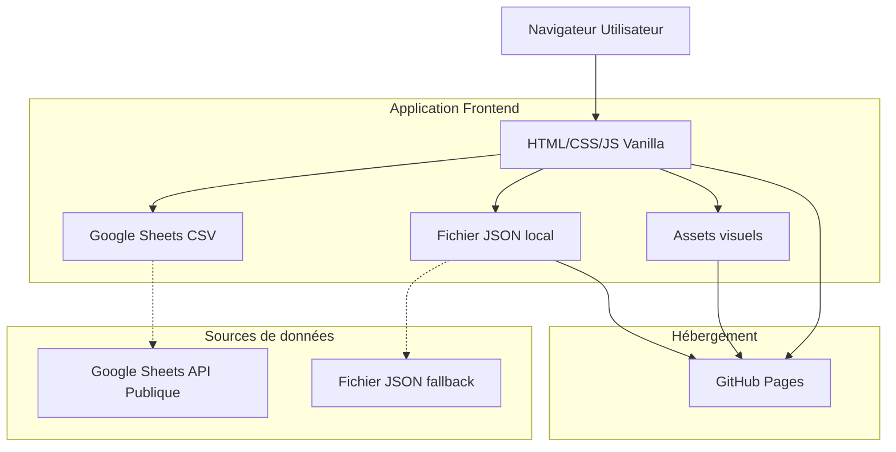

## 1. Architecture du projet



## 2. Description des technologies

- **Frontend** : HTML5, CSS3, JavaScript ES6+ (Vanilla)
- **Sources de données** : Google Sheets (CSV publié) + JSON local (fallback)
- **Hébergement** : GitHub Pages (gratuit)
- **Aucun backend** : Application statique pure
- **Récupération données** : Fetch API pour CSV Google Sheets

## 3. Structure des fichiers

```
tableau_grade_guilde/
├── index.html              # Page principale
├── css/
│   ├── main.css           # Styles principaux
│   ├── responsive.css     # Media queries
│   └── theme.css          # Variables couleurs/fonts
├── js/
│   ├── app.js             # Logique principale
│   ├── data.js            # Chargement données
│   └── ui.js              # Manipulation DOM
├── data/
│   └── grades.json        # Données des grades
├── assets/
│   ├── images/            # Images de grades
│   └── icons/             # Icônes SVG
└── README.md              # Documentation
```

## 4. Définition des routes

| Fichier | Route | Objectif |
|--------|--------|----------|
| index.html | / | Page principale affichant le tableau des grades |
| grades.json | /data/grades.json | Données modulaires des grades (accessible en lecture) |

## 5. Structure des données JSON

### 5.1 Format du fichier grades.json
```json
{
  "guildName": "Nom de la guilde",
  "lastUpdated": "2024-01-01",
  "grades": [
    {
      "id": "leader",
      "name": "Leader",
      "level": 1,
      "icon": "crown.svg",
      "color": "#FFD700",
      "description": "Chef de guilde",
      "permissions": [
        "Gérer tous les grades",
        "Modifier les paramètres de guilde",
        "Inviter/exclure des membres"
      ]
    },
    {
      "id": "officer",
      "name": "Officier", 
      "level": 2,
      "icon": "sword.svg",
      "color": "#C0C0C0",
      "description": "Officier de guilde",
      "permissions": [
        "Inviter des membres",
        "Gérer l'annonce de guilde",
        "Modérer le chat"
      ]
    }
  ]
}
```

### 5.2 Format Google Sheets CSV
**Structure des colonnes pour Google Sheets :**
| Colonne | Type | Description | Obligatoire |
|---------|------|-------------|-------------|
| id | String | Identifiant unique du grade | Oui |
| name | String | Nom du grade (max 50 chars) | Oui |
| level | Number | Niveau hiérarchique (1 = plus haut) | Oui |
| icon | String | Nom du fichier SVG | Non |
| color | String | Code couleur hex | Non |
| description | String | Description du grade (max 200 chars) | Oui |
| permissions | String | Permissions séparées par des virgules | Oui |

**Exemple de ligne CSV :**
```
id,name,level,icon,color,description,permissions
leader,Leader,1,crown.svg,#FFD700,Chef de guilde,"Gérer tous les grades,Modifier les paramètres de guilde,Inviter/exclure des membres"
```

## 6. Architecture JavaScript

### 6.1 Structure modulaire
```javascript
// data.js - Gestion des données
class GradeDataManager {
  constructor() {
    this.googleSheetUrl = 'https://docs.google.com/spreadsheets/d/[ID]/export?format=csv';
    this.fallbackData = '/data/grades.json';
  }
  
  async loadGrades() {
    // Essayer Google Sheets d'abord
    try {
      const response = await fetch(this.googleSheetUrl);
      const csvText = await response.text();
      return this.parseCSV(csvText);
    } catch (error) {
      // Fallback sur JSON local
      console.log('Google Sheets non disponible, utilisation du JSON local');
      const response = await fetch(this.fallbackData);
      return await response.json();
    }
  }
  
  parseCSV(csvText) { /* Convertit CSV en objet JSON */ }
  getGradeById(id) { /* Retourne grade spécifique */ }
  sortGradesByLevel() { /* Trie par niveau hiérarchique */ }
}

// ui.js - Manipulation interface
class GradeUIRenderer {
  renderGradeTable(grades) { /* Génère HTML du tableau */ }
  renderGradeDetails(grade) { /* Affiche détails grade */ }
  handleResponsiveLayout() { /* Gère breakpoints */ }
}

// app.js - Logique principale
class GuildGradeApp {
  constructor() {
    this.dataManager = new GradeDataManager();
    this.uiRenderer = new GradeUIRenderer();
  }
  
  async init() { /* Initialise l'application */ }
}
```

## 7. Optimisations Discord Embed

### 7.1 Métadonnées Open Graph
```html
<meta property="og:title" content="Grades - [Nom Guilde]">
<meta property="og:description" content="Découvre la hiérarchie complète de notre guilde">
<meta property="og:image" content="./assets/preview-grades.png">
<meta property="og:url" content="https://[username].github.io/tableau_grade_guilde/">
<meta name="twitter:card" content="summary_large_image">
```

### 7.2 Preview optimisé
- Image de preview : 1200x630px montrant un aperçu du tableau
- Titre concis incluant le nom de guilde
- Description engageante invitant à consulter le tableau

## 8. Configuration GitHub Pages

### 8.1 Repository settings
- Branch : main
- Folder : / (root)
- Custom domain : Optionnel

### 8.2 Fichier .github/workflows/deploy.yml (optionnel pour CI/CD)
```yaml
name: Deploy to GitHub Pages
on:
  push:
    branches: [ main ]
jobs:
  deploy:
    runs-on: ubuntu-latest
    steps:
    - uses: actions/checkout@v2
    - name: Deploy
      uses: peaceiris/actions-gh-pages@v3
      with:
        github_token: ${{ secrets.GITHUB_TOKEN }}
        publish_dir: ./
```

## 9. Guide de personnalisation

### 9.1 Modifier les grades (Méthode Google Sheets - Recommandée)
1. **Ouvrir la Google Sheet** partagée avec l'équipe
2. **Modifier les données** directement dans les cellules :
   - Colonne A: id (identifiant unique)
   - Colonne B: name (nom du grade)
   - Colonne C: level (niveau hiérarchique)
   - Colonne D: icon (nom icône SVG)
   - Colonne E: color (code couleur hex)
   - Colonne F: description (description du grade)
   - Colonne G: permissions (permissions séparées par virgules)
3. **Publier la sheet** : Fichier → Partager → Publier sur le web
4. **Choisir format CSV** et copier l'URL
5. **Mettre à jour l'URL** dans le code si nécessaire
6. **Les changements sont instantanés** - pas besoin de redéployer

### 9.2 Modifier les grades (Méthode JSON - Fallback)
1. Ouvrir `data/grades.json` (si Google Sheets indisponible)
2. Ajouter/modifier/supprimer des objets grade
3. Sauvegarder et commit les changements
4. GitHub Pages se met à jour automatiquement

### 9.2 Modifier l'apparence
1. Éditer `css/theme.css` pour couleurs/fonts
2. Modifier `css/main.css` pour layout général
3. Tester responsive sur différentes tailles d'écran

### 9.3 Ajouter des icônes
1. Placer fichiers SVG dans `assets/icons/`
2. Référencer dans grades.json via le champ `icon`
3. Optimiser SVG pour taille minimale